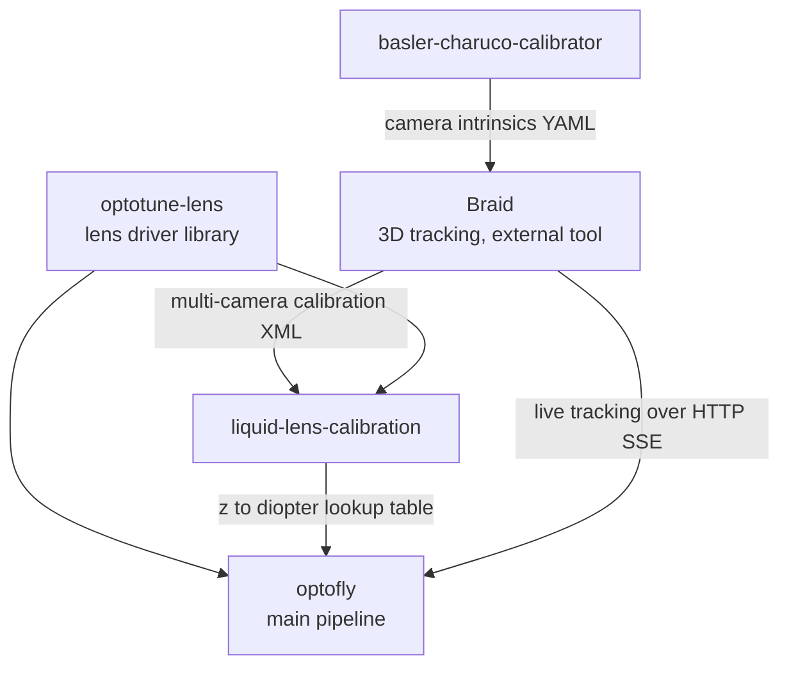

# Overview

## What "OptoFly" means

OptoFly is a lab setup, not a single program. Flies are tracked in 3D in
real time by a multi-camera system, and when a fly enters a defined zone,
the system can: start recording video of it, fire an LED for optogenetic
stimulation, show it a visual stimulus, and keep a liquid lens focused on it
as it moves. Four separate pieces of software make that possible.

## The four repos, and how they relate

- **`optofly`** is the main pipeline that actually runs experiments. It
  connects to a running Braid tracking system, and at runtime uses the
  liquid lens driver (`optotune-lens`) with the calibration table produced
  by `liquid-lens-calibration` to keep flies in focus.
- **`basler-charuco-calibrator`** is a one-time-per-camera tool: it
  calibrates the intrinsics (focal length, distortion) of each Basler
  camera in the tracking rig. Its output feeds into Braid's own multi-camera
  extrinsic calibration — a separate, external tool not part of this
  ecosystem.
- **`liquid-lens-calibration`** is a one-time-per-rig tool: using the same
  camera calibration Braid uses, it measures how the liquid lens's focus
  setting ("diopter") relates to real-world distance, and produces a
  lookup table `optofly` reads at runtime.
- **`optotune-lens`** is not a standalone tool — it's a small Python library
  (serial-port driver for the Optotune lens hardware) that both `optofly`
  and `liquid-lens-calibration` depend on directly. Both expect it checked
  out as a sibling directory (`../optotune-lens`).

## Who needs which repo

- Setting up tracking cameras for the first time: `basler-charuco-calibrator`.
- Setting up (or re-calibrating) the liquid lens for a rig: `optotune-lens`
  and `liquid-lens-calibration`.
- Running day-to-day experiments once the rig is calibrated: `optofly` only.

See [Workflow](workflow.md) for the exact order these steps happen in.
