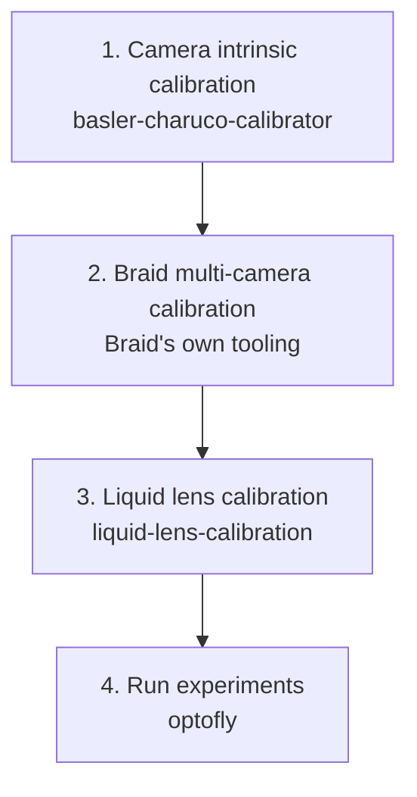

# Workflow

This page shows the full pipeline in the order you actually do it, from a
brand-new rig to a running experiment. Each step depends on the one before
it — don't skip ahead.

| # | Step | Tool | What it produces |
|---|---|---|---|
| 1 | Camera intrinsic calibration | [`basler-charuco-calibrator`](repos/basler-charuco-calibrator/README.md) | A per-camera YAML with focal length and distortion coefficients. Repeat once per tracking camera. |
| 2 | Braid multi-camera (extrinsic) calibration | Braid's own tooling (not part of this ecosystem) | An XML describing where each camera sits relative to the others — what Braid uses to triangulate 3D fly positions. |
| 3 | Liquid lens calibration | [`liquid-lens-calibration`](repos/liquid-lens-calibration/README.md) | A `z → diopter` lookup table, using the same camera geometry from step 2 to triangulate a target's true distance. |
| 4 | Run experiments | [`optofly`](repos/optofly/getting-started.md) | Live tracking, triggered recording, optogenetic stimulation, autofocus, visual stimuli. |

> ⚠️ **Common failure:** step 3 fails to triangulate any AprilTag — usually
> means the calibration XML path (`--calibration`) points at a stale or
> wrong file, or Braid isn't actually running and tracking yet. Confirm
> Braid's own web UI shows live 3D tracks before starting step 3.

## Within step 4: what happens during a single experiment run

Once calibration (steps 1–3) is done, everything below happens inside
`optofly` itself every time an experiment runs — no separate repos involved:

1. `optofly` connects to Braid's live tracking feed.
2. When a tracked fly enters the outer trigger zone, video recording starts
   and the liquid lens (driven via `optotune-lens`, using the lookup table
   from step 3) begins tracking the fly's distance to stay in focus.
3. If the fly reaches a smaller zone nested inside the outer one, an LED
   fires for optogenetic stimulation, a visual stimulus displays, or both —
   depending on which are enabled in that experiment's configuration.
4. When the fly leaves the outer zone, recording and lens tracking stop for
   that fly.

See [`optofly`'s own Calibration doc](repos/optofly/calibration.md) for the
full technical detail behind each step, including exact commands.
