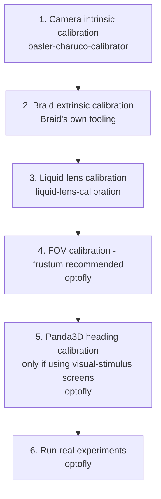

# Workflow

This page shows the full pipeline in the order you actually do it, from a
brand-new rig to a running experiment. Each step depends on the one before
it — don't skip ahead.

There are **six steps in total**. Steps 1–3 each live in a different
repo; steps 4–5 all happen inside `optofly` itself (not a separate repo,
but still one-time, by-hand calibration just like 1–3); step 6 is running
a real experiment. Every step below links straight to its full
instructions — click the step name, not just the repo name.



| # | Step | Tool | What it produces |
|---|---|---|---|
| 1 | [Camera intrinsic calibration](repos/basler-charuco-calibrator/README.md) | `basler-charuco-calibrator` | A per-camera YAML with focal length and distortion coefficients. Repeat once per tracking camera. |
| 2 | [Braid multi-camera (extrinsic) calibration](setup/braid-extrinsic-calibration.md) | Braid's own tooling (not part of this ecosystem) | An XML describing where each camera sits relative to the others — what Braid uses to triangulate 3D fly positions. |
| 3 | [Liquid lens calibration](repos/liquid-lens-calibration/README.md) | `liquid-lens-calibration` (driving the lens via `optotune-lens`, reading focus frames via [`ximea-py`](repos/ximea-py/README.md)) | A `z → diopter` lookup table, using the same camera geometry from step 2 to triangulate a target's true distance. |
| 4 | FOV calibration — use [frustum](repos/optofly/calibration.md#frustum-fov-calibration) (**recommended**, more accurate); [flat](repos/optofly/calibration.md#camera-fov-calibration) only for a quick throwaway test rig | `optofly` | The camera's field-of-view bounds, written into `optofly`'s `config.toml`, so it knows what's actually in frame. |
| 5 | [Panda3D heading calibration](repos/optofly/calibration.md#panda3d-heading-calibration) — only if this rig uses visual-stimulus screens | `optofly` | An offset that aligns Braid's tracked heading with the arena's screens. |
| 6 | [Run real experiments](repos/optofly/getting-started.md) | `optofly` | Live tracking, triggered recording, optogenetic stimulation, autofocus, visual stimuli. |

> ⚠️ **Common failure:** step 3 fails to triangulate any AprilTag — usually
> means the calibration XML path (`--calibration`) points at a stale or
> wrong file, or Braid isn't actually running and tracking yet. Confirm
> Braid's own web UI shows live 3D tracks before starting step 3.

> ⚠️ **Common failure:** looking for steps 4–5 in this repo and not finding
> them — they're documented in `optofly`'s own repo, not here. Follow the
> links in the table above; don't go looking for separate `optofly-docs`
> pages for them.

## Lighting during calibration

Steps 1–2 (camera intrinsic and Braid extrinsic calibration) and steps
4–5 (`optofly`'s own [FOV](repos/optofly/calibration.md#frustum-fov-calibration)
and [Panda3D heading](repos/optofly/calibration.md#panda3d-heading-calibration)
calibration, when done with a laser pointer as the target) all need
specific lighting in the arena. Get this wrong and the calibration board or
laser dot can be hard for the camera to pick out cleanly.

- **Intrinsic and extrinsic calibration** (steps 1–2, ChArUco board):
  turn on only the lights mounted above the arena. The floor backlight
  (driven by the Arduino, see below) is not needed for this — leaving it on
  doesn't hurt, but there's no benefit to it either.
- **Laser pointer calibration** (steps 4–5, when using a laser pointer as
  the target — see [`optofly`'s Calibration
  doc](repos/optofly/calibration.md)): turn off **both** the backlight
  and the overhead lights. Either light source can wash out or be mistaken
  for the laser's bright spot by the detection threshold.

The overhead lights are powered by a benchtop power supply, already set to
the correct voltage — don't change the voltage dial. Turn them on and off
using the power supply's output on/off switch (or button), not the voltage
knob. The backlight, however, is wired to the Arduino (pin 9, see
[Optogenetic Trigger](repos/optofly/opto-trigger.md#hardware)) and can also
be switched off (or on) in software instead of physically unplugging it.

### Turning the backlight on/off from the Arduino IDE

1. Connect the Arduino via USB and open the Arduino IDE.
2. Go to **Tools > Port** and confirm the correct port is selected.
3. Open **Tools > Serial Monitor**.
4. Set the baud rate in the bottom-right of the Serial Monitor window to
   **115200** — commands sent at the wrong baud rate are ignored or
   garbled.
5. In the send box at the top, type `[0]` and press **Send** to turn the
   backlight off, or `[255]` to turn it fully on. Values in between (e.g.
   `[128]`) set partial brightness.

> ⚠️ **Common failure:** nothing happens when you send a command — the
> Serial Monitor's line-ending setting (bottom-right dropdown) must not
> mangle the brackets. "No line ending" or "Newline" both work; if it still
> doesn't respond, re-check the baud rate first.

### Turning the backlight on/off from a Python REPL

A **REPL** is an interactive Python prompt — you type one line of Python
at a time and see its result immediately, instead of running a whole
script file. Open one from inside the `optofly` repo, so the `pyserial`
package used below is already installed:

```bash
cd ~/src/optofly
uv run python
```

You'll see a `>>>` prompt waiting for input.

This uses the same serial protocol as the Arduino IDE method above, sent
with the [`pyserial`](https://pyserial.readthedocs.io/) package instead.
Useful if you'd rather script it or you're already in a Python session.
Type (or paste) these lines one at a time at the `>>>` prompt:

```python
import serial

ser = serial.Serial("/dev/opto_trigger", 115200)  # match your config.toml port
ser.write(b"[0]")     # backlight off
ser.write(b"[255]")   # backlight fully on
ser.close()
```

> ⚠️ **Common failure:** `PermissionError` or `SerialException` opening the
> port — another program (e.g. a running `optofly` experiment, or the
> Arduino Serial Monitor) already has the port open. Only one process can
> hold it at a time; close the other one first.

## Full-pipeline dry run with a laser

This is the last thing to do before running a real experiment — after
steps 1–5 in the table above.

Everything so far only confirms that individual pieces work: Braid
tracks in 3D, the lens has a lookup table, the screens are aligned. It
doesn't confirm that `optofly` itself — recording, lens tracking, the
optogenetic trigger, visual stimuli — reacts correctly when something
moves through the arena. A laser pointer's dot is a controllable
stand-in for a fly for this check, the same trick used to sanity-check
tracking during extrinsic calibration (see [Braid Extrinsic
Calibration](setup/braid-extrinsic-calibration.md#optional-verify-tracking-with-a-laser)),
taken one step further to exercise the whole pipeline instead of just
Braid.

Turn off the arena lights first — see [Lighting during
calibration](#lighting-during-calibration) above — then launch Braid
tracking the laser:

```bash
braid-run ~/braid-configs/laser.toml
```

In another terminal, launch `optofly` itself:

```bash
cd ~/src/OptoFly
uv run main.py --skip-metadata
```

`--skip-metadata` skips the usual experiment-metadata prompt, since this
is a quick test rather than a real recording. With the laser standing in
for a fly, move its dot into `optofly`'s trigger zone and confirm the
response you expect actually happens — recording starts, the lens
tracks focus, the optogenetic trigger or a visual/light stimulus fires —
whichever this rig has configured.

Keep this trick in your back pocket beyond calibration, too: it's a
convenient way to check later that the optogenetic trigger or a
visual/light stimulus is actually firing, without needing a live fly.

## Measuring optogenetic light power across the arena

This is a QC (quality control) check, not one of the six pipeline steps
above — run it occasionally rather than before every experiment: after
moving or replacing LEDs, changing stimulus intensity, or if flies in one
part of the arena seem to respond differently than flies in another.

[`braid-opto-power-measure`](setup/braid-opto-power-measure-setup.md) sweeps
a power meter by hand through the arena while Braid tracks its position,
and produces heatmaps of both the ambient light level and the optogenetic
LED's ON-state intensity at every position — showing whether the stimulus
is even across the arena or stronger in some spots than others.

## What happens during step 6: a single experiment run

Once calibration is fully done — steps 1–5 in the table above —
everything below happens inside `optofly` itself every time an
experiment runs, no separate repos involved:

1. `optofly` connects to Braid's live tracking feed.
2. When a tracked fly enters the outer trigger zone, video recording starts
   and the liquid lens (driven via `optotune-lens`, using the lookup table
   from step 3) begins tracking the fly's distance to stay in focus.
3. If the fly reaches a smaller zone nested inside the outer one, an LED
   fires for optogenetic stimulation, a visual stimulus displays, or both —
   depending on which are enabled in that experiment's configuration.
4. When the fly leaves the outer zone, recording and lens tracking stop for
   that fly.

See [`optofly`'s own Calibration doc](repos/optofly/calibration.md) for the
full technical detail behind each step, including exact commands.

If Braid itself (or the whole computer) crashes partway through a
recording, see [Braid crashed while recording, leaving a `.braid` folder
behind](troubleshooting.md#braid-crashed-while-recording-leaving-a-braid-folder-behind)
to recover the data by hand.
