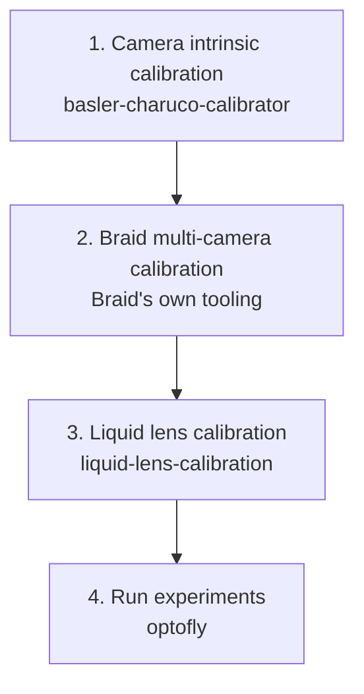

# Workflow

This page shows the full pipeline in the order you actually do it, from a
brand-new rig to a running experiment. Each step depends on the one before
it — don't skip ahead.



| # | Step | Tool | What it produces |
|---|---|---|---|
| 1 | Camera intrinsic calibration | [`basler-charuco-calibrator`](repos/basler-charuco-calibrator/README.md) | A per-camera YAML with focal length and distortion coefficients. Repeat once per tracking camera. |
| 2 | Braid multi-camera (extrinsic) calibration | Braid's own tooling (not part of this ecosystem) | An XML describing where each camera sits relative to the others — what Braid uses to triangulate 3D fly positions. |
| 3 | Liquid lens calibration | [`liquid-lens-calibration`](repos/liquid-lens-calibration/README.md) (driving the lens via `optotune-lens` and reading focus frames via [`ximea-py`](repos/ximea-py/README.md)) | A `z → diopter` lookup table, using the same camera geometry from step 2 to triangulate a target's true distance. |
| 4 | Run experiments | [`optofly`](repos/optofly/getting-started.md) | Live tracking, triggered recording, optogenetic stimulation, autofocus, visual stimuli. |

> ⚠️ **Common failure:** step 3 fails to triangulate any AprilTag — usually
> means the calibration XML path (`--calibration`) points at a stale or
> wrong file, or Braid isn't actually running and tracking yet. Confirm
> Braid's own web UI shows live 3D tracks before starting step 3.

## Lighting during calibration

Steps 1 and 2 (camera intrinsic and Braid extrinsic calibration) and the
laser-based FOV calibration described in
[`optofly`'s Calibration doc](repos/optofly/calibration.md) all need
specific lighting in the arena. Get this wrong and the calibration board or
laser dot can be hard for the camera to pick out cleanly.

- **Intrinsic and extrinsic calibration** (steps 1–2, ChArUco board):
  turn on only the lights mounted above the arena. The floor backlight
  (driven by the Arduino, see below) is not needed for this — leaving it on
  doesn't hurt, but there's no benefit to it either.
- **Laser pointer calibration** (the FOV sweep in
  [`optofly`'s Calibration doc](repos/optofly/calibration.md)): turn off
  **both** the backlight and the overhead lights. Either light source can
  wash out or be mistaken for the laser's bright spot by the detection
  threshold.

The overhead lights are powered by a benchtop power supply, already set to
the correct voltage — don't change the voltage dial. Turn them on and off
using the power supply's output on/off switch (or button), not the voltage
knob. The backlight, however, is wired to the Arduino (pin 9, see
[Optogenetic Trigger](repos/optofly/opto-trigger.md#hardware)) and can also
be switched off (or on) in software instead of physically unplugging it.

### Turning the backlight on/off from the Arduino IDE

1. Connect the Arduino via USB and open the Arduino IDE.
2. Go to **Tools > Port** and confirm the correct port is selected.
3. Open **Tools > Serial Monitor**.
4. Set the baud rate in the bottom-right of the Serial Monitor window to
   **115200** — commands sent at the wrong baud rate are ignored or
   garbled.
5. In the send box at the top, type `[0]` and press **Send** to turn the
   backlight off, or `[255]` to turn it fully on. Values in between (e.g.
   `[128]`) set partial brightness.

> ⚠️ **Common failure:** nothing happens when you send a command — the
> Serial Monitor's line-ending setting (bottom-right dropdown) must not
> mangle the brackets. "No line ending" or "Newline" both work; if it still
> doesn't respond, re-check the baud rate first.

### Turning the backlight on/off from a Python REPL

A **REPL** is an interactive Python prompt — you type one line of Python
at a time and see its result immediately, instead of running a whole
script file. Open one from inside the `optofly` repo, so the `pyserial`
package used below is already installed:

```bash
cd ~/src/optofly
uv run python
```

You'll see a `>>>` prompt waiting for input.

This uses the same serial protocol as the Arduino IDE method above, sent
with the [`pyserial`](https://pyserial.readthedocs.io/) package instead.
Useful if you'd rather script it or you're already in a Python session.
Type (or paste) these lines one at a time at the `>>>` prompt:

```python
import serial

ser = serial.Serial("/dev/opto_trigger", 115200)  # match your config.toml port
ser.write(b"[0]")     # backlight off
ser.write(b"[255]")   # backlight fully on
ser.close()
```

> ⚠️ **Common failure:** `PermissionError` or `SerialException` opening the
> port — another program (e.g. a running `optofly` experiment, or the
> Arduino Serial Monitor) already has the port open. Only one process can
> hold it at a time; close the other one first.

## Within step 4: what happens during a single experiment run

Once calibration (steps 1–3) is done, everything below happens inside
`optofly` itself every time an experiment runs — no separate repos involved:

1. `optofly` connects to Braid's live tracking feed.
2. When a tracked fly enters the outer trigger zone, video recording starts
   and the liquid lens (driven via `optotune-lens`, using the lookup table
   from step 3) begins tracking the fly's distance to stay in focus.
3. If the fly reaches a smaller zone nested inside the outer one, an LED
   fires for optogenetic stimulation, a visual stimulus displays, or both —
   depending on which are enabled in that experiment's configuration.
4. When the fly leaves the outer zone, recording and lens tracking stop for
   that fly.

See [`optofly`'s own Calibration doc](repos/optofly/calibration.md) for the
full technical detail behind each step, including exact commands.

If Braid itself (or the whole computer) crashes partway through a
recording, see [Braid crashed while recording, leaving a `.braid` folder
behind](troubleshooting.md#braid-crashed-while-recording-leaving-a-braid-folder-behind)
to recover the data by hand.
